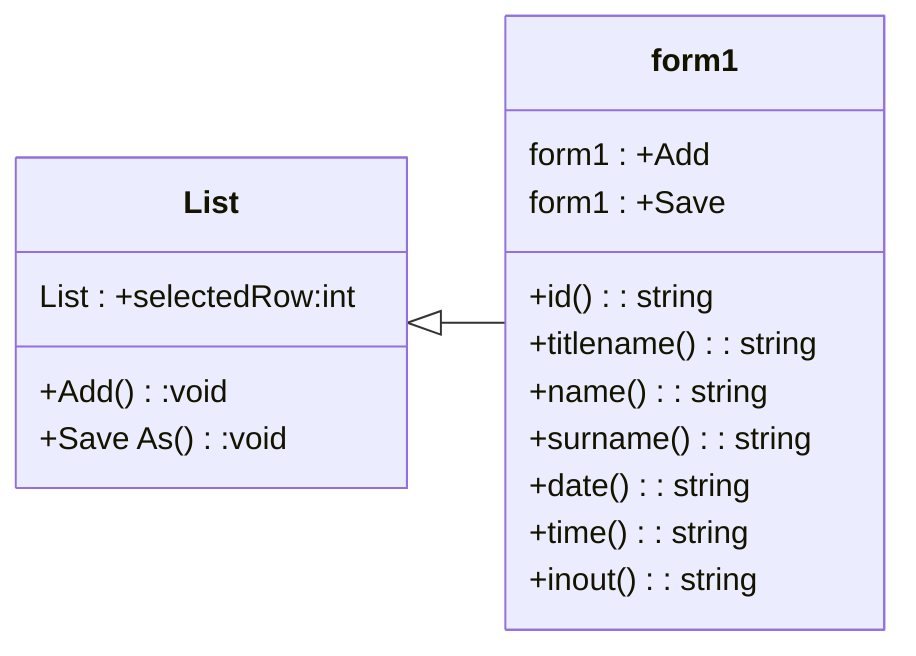

# ความเป็นมาของโปรแกรม
การเช็คข้อมูลของคนเข้าออก เหมือนการเช็คชื่อในห้องเรียนหรือการเช็คการเข้าออกภายในโรงเรียนในตอนประถม
โปรแกรมนี้สามารถเช็คคนเข้าออกแล้วเก็บข้อมูลลง DataGridView เพื่อ Export เป็นไฟล์ CSV สามารถเช็คย้อนหลังได้

# วัตถุประสงค์ของโปรแกรม
เพื่อพัฒนาระบบและอประเมินประสิทธิภาพเช็คชื่อผู้คนเข้าออก

# Class Diagram

  
